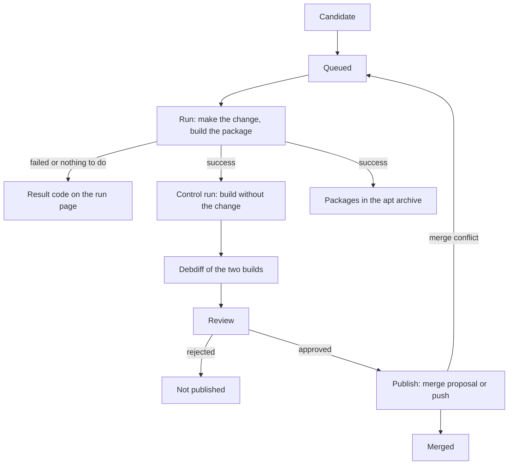

# Debian

## The lifetime of a run

A Debian run goes from a candidate in the queue to a merged change:

```mermaid
flowchart TD
    candidate[Candidate] --> queue[Queued]
    queue --> run[Run: make the change, build the package]
    run -->|failed or nothing to do| result[Result code on the run page]
    run -->|success| control[Control run: build without the change]
    control --> debdiff[Debdiff of the two builds]
    run -->|success| apt[Packages in the apt archive]
    debdiff --> review[Review]
    review -->|rejected| stop[Not published]
    review -->|approved| publish[Publish: merge proposal or push]
    publish -->|merge conflict| queue
    publish --> merged[Merged]
```
